# Hi, I'm Cody Averett

I'm a creative software engineer who likes exploring the great unknown while working within constraints. 
I have 15+ years professional experience across large enterprises as well as small startups.  
I love learning and helping others maximize their own potentials.

### Technologies

## Featured Projects

<!-- featured:start -->
### [galaxyclaw](https://github.com/galaxy-gateway/galaxyclaw)
Ultra-lightweight personal AI agent framework in Rust. _Stack: rust_

### [slacker](https://github.com/galaxy-gateway/slacker)
Chrome extension plus local Rust server that turns Slack web into a queryable feed. _Stack: javascript, rust_

### [metarepo](https://github.com/codyaverett/metarepo)
Manage fleets of git repos as one logical project. Rust rewrite of the Node meta tool. _Stack: rust, cli_

### [muse](https://github.com/galaxy-gateway/muse)
Terminal music explorer: browse, play, and visualize an audio tree. _Stack: rust, tui_

### [stable-audio](https://github.com/galaxy-gateway/stable-audio)
Music generation with Stability AI's stable-audio model. _Stack: python_

### [tiny-rust](https://github.com/codyaverett/tiny-rust)
Exploring how small a Rust binary can get, one technique at a time. _Stack: rust_

<!-- featured:end -->

## GitHub Stats

 

---

<!-- ops:start -->
Profile maintained by 3 automated pipelines · last human edit 18 days ago · metrics: 0% success over last 27 runs · $0.00 inference this month (no inference pipelines… yet) · last incident: metrics.yml (2026-06-30, auto-detected, [issue #100](https://github.com/codyaverett/codyaverett/issues/100)) · ledger: <code>git log --format='%h %(trailers:key=Workflow,valueonly)'</code>
<!-- ops:end -->

